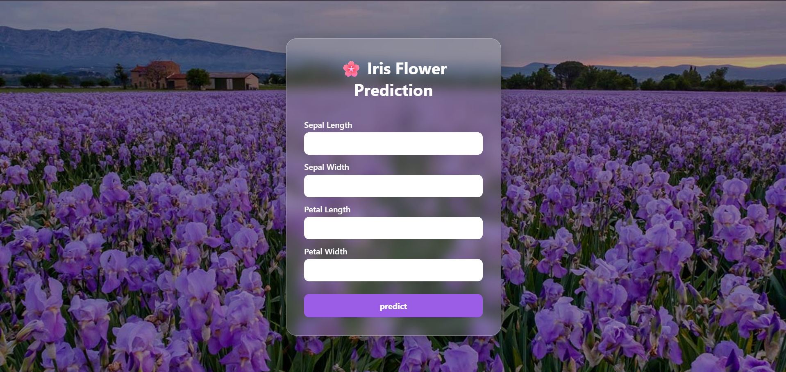
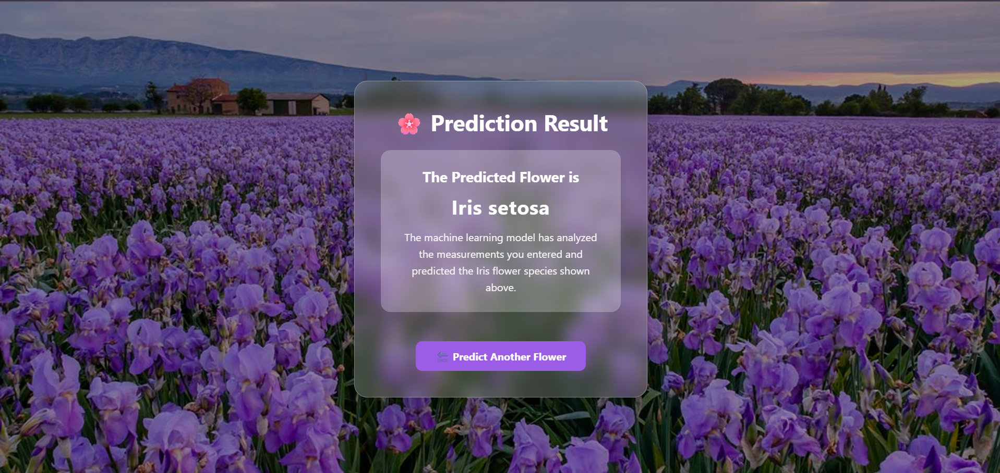

# 🌸 Iris Flower Prediction using Machine Learning

A Flask-based Machine Learning web application that predicts the species of an Iris flower based on sepal and petal measurements. The model is trained using Logistic Regression from Scikit-learn and deployed on PythonAnywhere.

---

## 🚀 Live Demo

🔗 https://rosebenny.pythonanywhere.com/

---

## ✨ Features

- 🌸 Predicts Iris flower species
- 🤖 Machine Learning model built with Logistic Regression
- 📊 StandardScaler used for feature scaling
- 💻 Responsive Flask web interface
- 🎨 Beautiful Glassmorphism UI with a flower background
- 🌐 Deployed online using PythonAnywhere

---

## 🛠️ Technologies Used

- Python
- Flask
- Scikit-learn
- NumPy
- HTML5
- CSS3
- Pickle
- Git
- GitHub
- PythonAnywhere

---

## 📂 Project Structure

```
Iris_Model/
│
├── app.py
├── model.py
├── model.pkl
├── scalerscaler.pkl
│
├── templates/
│   ├── index.html
│   └── result.html
│
├── static/
│   ├── style.css
│   └── iris_field.jpg
│
└── screenshots/
    ├── home.png
    └── result.png
```

---

## 📸 Screenshots

### Home Page



### Prediction Result



---

## ⚙️ Installation

### Clone the Repository

```bash
git clone https://github.com/rosbenny/iris-flower-prediction-flask.git
```

### Navigate to the Project

```bash
cd iris-flower-prediction-flask
```

### Install Dependencies

```bash
pip install flask scikit-learn numpy
```

### Run the Application

```bash
python app.py
```

Open your browser and visit:

```
http://127.0.0.1:5500
```

---

## 🧪 Sample Test Values

### Iris Setosa

| Feature | Value |
|----------|-------|
| Sepal Length | 5.1 |
| Sepal Width | 3.5 |
| Petal Length | 1.4 |
| Petal Width | 0.2 |

### Iris Versicolor

| Feature | Value |
|----------|-------|
| Sepal Length | 6.0 |
| Sepal Width | 2.9 |
| Petal Length | 4.5 |
| Petal Width | 1.5 |

### Iris Virginica

| Feature | Value |
|----------|-------|
| Sepal Length | 6.5 |
| Sepal Width | 3.0 |
| Petal Length | 5.8 |
| Petal Width | 2.2 |

---

## 👩‍💻 Author

**Rose Benny**

🎓 Final Year B.Tech Computer Science Student

📧 rosebenny2004@gmail.com

🌐 Live Project:
https://rosebenny.pythonanywhere.com/

💻 GitHub:
https://github.com/rosbenny

---

⭐ If you found this project useful, consider giving it a star on GitHub!
